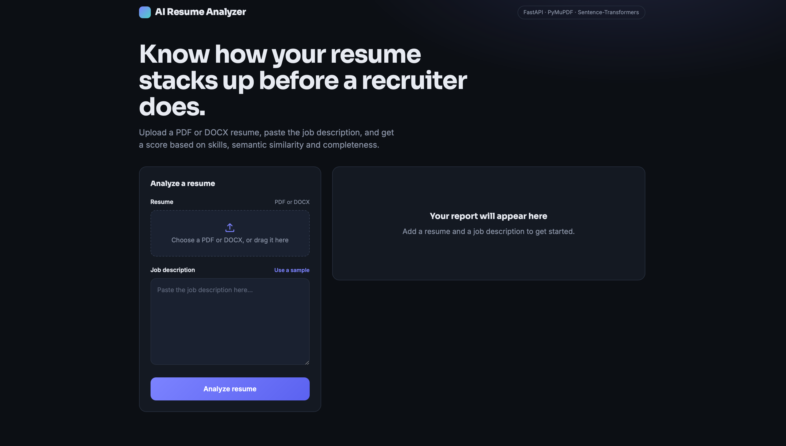
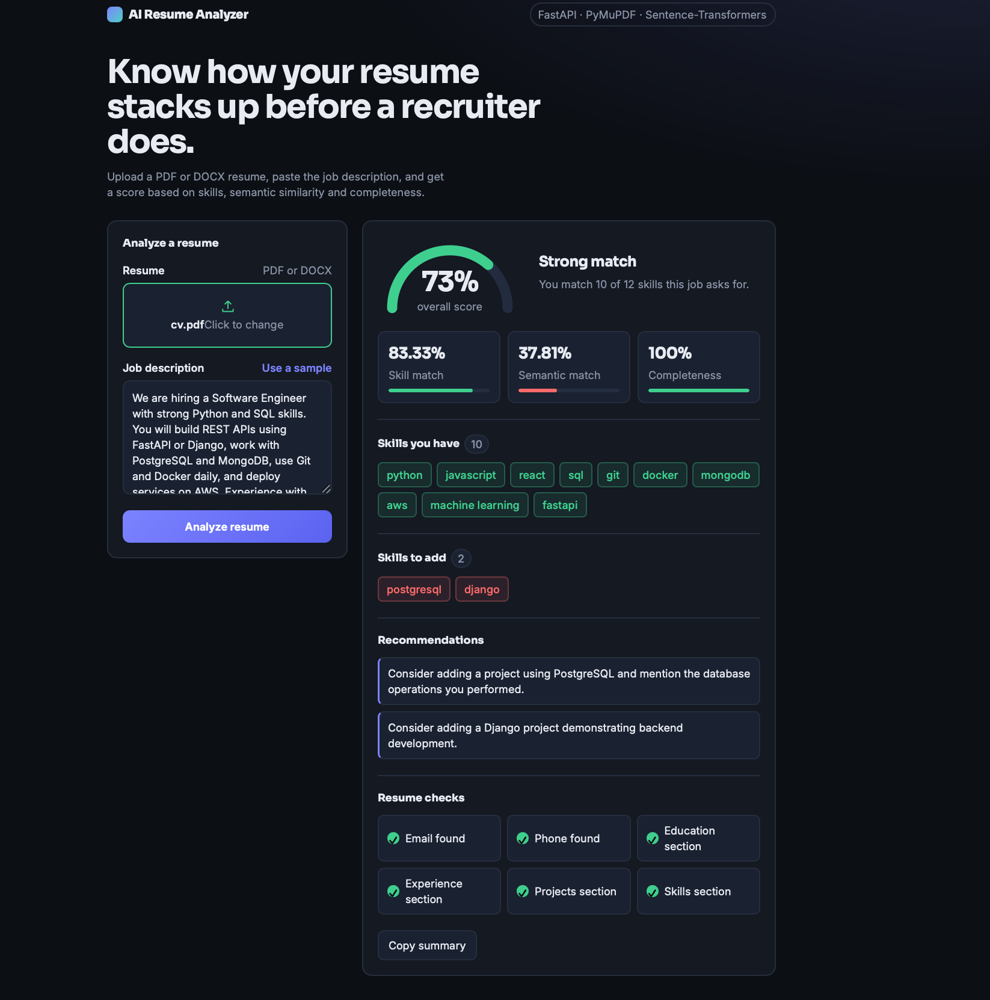
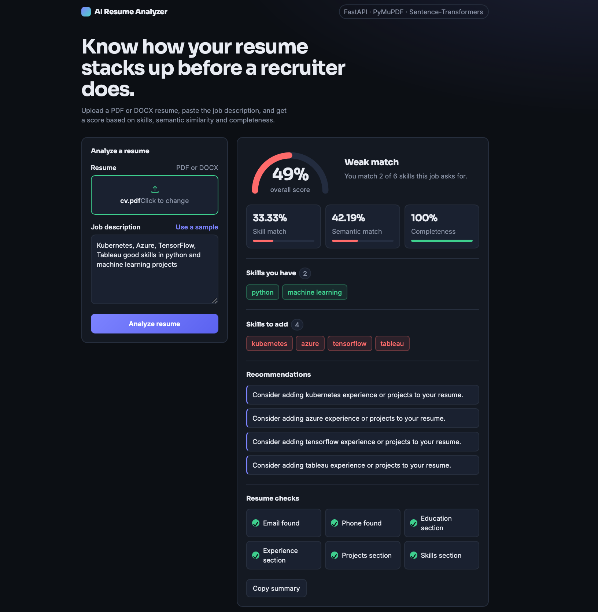

# AI Resume Analyzer

A web app that analyzes a resume (PDF or DOCX) against a job description and gives an overall score, matched and missing skills, and practical suggestions to improve the resume.

Built as a BTech final-year project.



## Features

- Upload a resume in **PDF or DOCX** format
- **Semantic match score** using sentence embeddings (understands meaning, not just keywords)
- **Skill match** with whole-word detection against a customizable skills list (`skills.json`)
- **Resume completeness check**: email, phone number (Indian formats supported), education, experience, projects, skills section
- **Overall score** (Strong / Average / Weak) combining all signals
- **Personalized recommendations** for missing skills and missing sections
- Modern responsive UI with an animated score gauge

## Screenshots

| Good match | Weak match |
|---|---|
|  |  |

## How it works

1. The resume text is extracted from the PDF (PyMuPDF) or DOCX (python-docx).
2. **Semantic score:** the resume and job description are converted into embeddings with the pretrained `all-MiniLM-L6-v2` model, and their cosine similarity is calculated.
3. **Skill match:** skills from `skills.json` found in the job description are checked against the resume using whole-word regex matching.
4. **Completeness:** six checks (email, phone, education, experience, projects, skills section).
5. **Overall score:**

```
overall = 0.5 * skill_match + 0.3 * semantic_score + 0.2 * completeness
```

If the job description contains no known skills, the score uses `0.6 * semantic + 0.4 * completeness` instead.

| Score | Label |
|---|---|
| 70 and above | Strong |
| 50 to 69 | Average |
| Below 50 | Weak |

The system is a **hybrid**: a pretrained NLP model for semantic similarity, plus rule-based logic for skills and structure. The score weights were chosen manually and have not been validated against real recruiter decisions.

## Tech stack

- **Backend:** Python, FastAPI, Uvicorn
- **NLP:** sentence-transformers (`all-MiniLM-L6-v2`)
- **File parsing:** PyMuPDF, python-docx
- **Frontend:** HTML, CSS, vanilla JavaScript

## Installation

```bash
git clone https://github.com/yashbendra/ai-resume-analyzer.git
cd ai-resume-analyzer

python3 -m venv venv
source venv/bin/activate        # Windows: venv\Scripts\activate

pip install -r requirements.txt
uvicorn main:app --reload
```

Then open **http://127.0.0.1:8000** in your browser.

> The first install downloads PyTorch and the first run downloads the language model, so it can take a few minutes.

## Project structure

```
ai-resume-analyzer/
├── main.py              # FastAPI app and analysis logic
├── skills.json          # List of skills to detect (easy to extend)
├── templates/
│   └── index.html       # Frontend
├── screenshots/         # Images used in this README
├── requirements.txt
└── README.md
```

## Limitations

- The embedding model reads only the first ~256 tokens, so very long resumes are partly ignored in the semantic score.
- Skills are detected from a fixed list. Spelling variants (for example "ReactJS" or "postgres") and skills outside the list are not detected.
- Section checks are keyword-based, so a resume can pass a check without a real section.
- Scanned or image-only PDFs are not supported (no OCR).
- The scores are estimates and have not been validated against recruiter decisions.

## Future improvements

- Split long resumes into chunks for a more accurate semantic score
- Skill synonyms and automatic skill extraction (NER)
- Train a resume-category classifier on a labeled dataset
- OCR support for scanned resumes
- Online deployment

## Author

**Yashbendra Singh**: BTech, CSE, Bennett University
[GitHub](https://github.com/yashbendra)

## License

MIT
